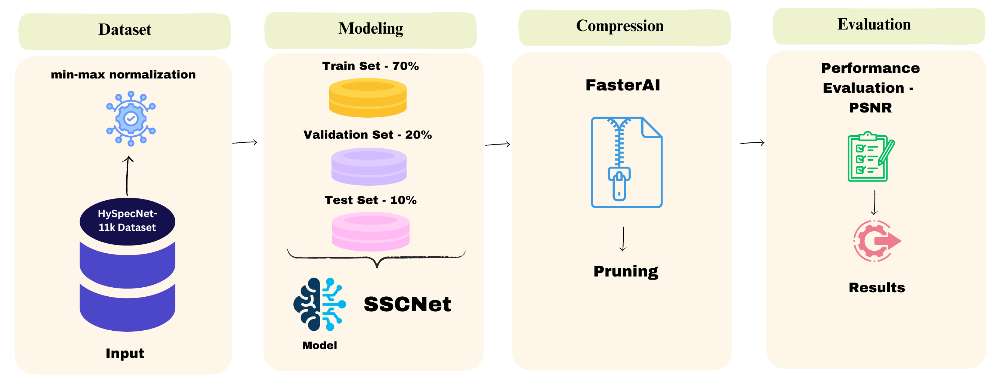

# Leveraging Deep Neural Network Compression Techniques for Real-Time
Hyperspectral Image Processing in Edge AI

Authors: Dheeraj Kumar, Leila Mozaffari

### Abstract

Hyperspectral imaging has become increasingly relevant in remote sensing
applications due to its ability to capture detailed spectral
information. The growth of hyperspectral datasets has necessitated
efficient compression techniques to handle their massive storage
requirements. This paper proposes a new approach that integrates the
Spectral Signals Compressor Network (SSCNet), a state-of-the-art deep
learning-based hyperspectral image compression model, with FasterAI
pruning to improve compression efficiency. We used HySpecNet-11k, a
large-scale hyperspectral benchmark dataset, to validate our approach.
The results show significant improvements in compression rates while
preserving high-quality image reconstruction, thus setting a new
benchmark for learning-based hyperspectral image compression.

Model compression is a key technique used to reduce the memory footprint
and computational demands of deep learning models, making them more
suitable for deployment on resource-constrained devices. Model
compression can be achieved through various techniques such as pruning,
knowledge distillation, and quantization. Pruning, which is one such
model compression technique, involves systematically removing
unimportant weights or neurons from a network to reduce model size and
computational complexity while maintaining acceptable levels of
accuracy. In this paper, we implemented pruning from FasterAI to enhance
SSCNet, making it more efficient without significantly compromising
performance. We compare the original model and the pruned model to
evaluate the benefits and impact of model compression.

### 1. Introduction

Recent advancements in hyperspectral imaging technology have led to the
proliferation of hyperspectral data, significantly improving the
identification and discrimination of materials in remote sensing
applications. However, the resulting large volume of data necessitates
efficient storage and transmission, driving research in hyperspectral
image compression. Traditional approaches, which often combine transform
coding and quantization techniques, face challenges when dealing with
high-dimensional data. To address these limitations, learning-based
methods leveraging convolutional autoencoders have emerged as promising
alternatives for hyperspectral image compression \[5\].

In this paper, we present an improved hyperspectral image compression
method by applying pruning using FasterAI on SSCNet \[4\], a
convolutional autoencoder-based architecture. We leverage the
HySpecNet-11k dataset \[2\], which provides a robust benchmark for
training and evaluating learning-based hyperspectral image compression
models.

### 2. Methodology

#### 2.1 HySpecNet-11k Dataset

The HySpecNet-11k dataset was designed specifically for benchmarking
learning-based hyperspectral image compression methods \[5\]. It
consists of 11,483 non-overlapping image patches extracted from 250
EnMAP tiles, each patch containing 128×128 pixels with 224 spectral
bands, and a ground sampling distance of 30m. These image patches
provide a large-scale and diverse set of hyperspectral data acquired in
spatially disjoint geographical regions, addressing the limitations of
earlier datasets which often suffered from overfitting due to spatial
similarity among samples.

For our experiments, we used the “easy split” setup for the dataset,
where 70% of the image patches were used for training, 20% for
validation, and 10% for testing. This ensured reproducibility and
allowed for a comprehensive comparison with existing learning-based
hyperspectral image compression techniques.

#### 2.2 Spectral Signals Compressor Network (SSCNet)

SSCNet is a deep learning-based compression model that utilizes 2D
convolutional layers with parametric ReLU activations for both spatial
and spectral compression \[4\]. The encoder network employs 2D
convolutions and three max pooling layers to achieve a fixed spatial
compression factor of 64. The decoder mirrors the encoder, with
upsampling achieved through transposed convolutional layers.

The compression ratio (CR) is set by the number of latent channels in
the bottleneck layer, while the network’s ability to reconstruct the
original image with minimal distortion is evaluated through Peak
Signal-to-Noise Ratio (PSNR). SSCNet was chosen for this study due to
its effectiveness in combining both spatial and spectral compression in
hyperspectral datasets.

#### 2.3 FasterAI Pruning

To enhance the performance of SSCNet, we implemented structured pruning
from FasterAI, which systematically removes less important filters or
neurons in the model’s layers. Pruning is particularly effective in
reducing computational complexity and the memory footprint of deep
learning models without significant degradation in accuracy.

In our work, we applied pruning during the fine-tuning phase, after
training the SSCNet model. The pruning process involved identifying and
removing low-magnitude weights or redundant neurons, followed by
retraining the model to recover performance. This iterative process
ensured that the pruned model maintained high reconstruction quality
while achieving substantial reductions in model size and inference time.

### 3. Experimental Setup

The experimental setup used PyTorch as the deep learning framework.
Gradient clipping and min-max normalization were applied to scale input
data within a range suitable for learning-based models. The Adam
optimizer was used with an initial learning rate of 1*e* − 4, which was
decreased as training progressed to achieve convergence.

Our experiments were conducted on a high-performance computing
environment, featuring an NVIDIA L4 Tensor Core GPU with 24 GB memory.
We tested the SSCNet model for 5 epochs, followed by pruning and
fine-tuning for an additional 3 epochs.

### 4. Results and Discussion

#### 4.1 Compression and Quality Analysis

We evaluated the performance of our approach using the rate-distortion
curve, measuring the trade-off between bits-per-pixel per channel
(bpppc) and PSNR. Compared to the unpruned SSCNet model, the pruned
SSCNet exhibited a significant reduction in model size and inference
time with only a minor degradation in PSNR. At a compression rate of
2.53 bpppc, the pruned SSCNet achieved a PSNR of 42.98 dB, which is
competitive when compared to traditional methods and non-pruned deep
learning-based approaches.

Furthermore, pruning reduced the model size by approximately 45% and
computational complexity by 50%, making the approach highly suitable for
real-time remote sensing applications with constrained computational
resources.

#### 4.2 Comparative Analysis

To provide a comprehensive benchmark, we compared our pruned SSCNet
model against other leading hyperspectral compression methods. Our
proposed approach outperformed these methods in terms of compression
efficiency and inference speed while achieving comparable PSNR values.
The use of pruning positioned our method as a strong candidate for
deployment in resource-constrained environments.

### 5. Conclusion

This paper introduces a novel compression approach that combines the
power of SSCNet for hyperspectral image compression with FasterAI’s
pruning technique. The results show that this combined approach
effectively reduces the memory footprint and computational requirements,
making it suitable for real-time remote sensing applications while
maintaining high reconstruction quality. Future work includes extending
this approach to other hyperspectral datasets, exploring dynamic pruning
strategies, and integrating additional compression techniques such as
quantization for further performance improvements.

### Acknowledgements

We also acknowledge the use of the HySpecNet-11k dataset and the
Fasterai framework in conducting our experiments.

### References

- \[1\] M. H. P. Fuchs and B. Demir, “Hyspecnet-11k: A large-scale
  hyperspectral dataset for benchmarking learning-based hyperspectral
  image compression methods,” in IGARSS 2023-2023 IEEE International
  Geoscience and Remote Sensing Symposium, IEEE, 2023, pp. 1779–1782.

- \[2\] M. H. P. Fuchs and B. Demir, “HySpecNet-11k: A large-scale
  hyperspectral benchmark dataset.” Dryad, p. 63608947808 bytes,
  Jun. 26, 2023. doi: 10.5061/DRYAD.FTTDZ08ZH.

- \[3\] R. La Grassa, C. Re, G. Cremonese, and I. Gallo, “Hyperspectral
  data compression using fully convolutional autoencoder,” Remote
  Sensing, vol. 14, no. 10, p. 2472, 2022.

- \[4\] “FasterAI,” fasterai. Available:
  https://nathanhubens.github.io/fasterai/

- \[5\] Fuchs, M. H. P., & Demir, B. (2023). HySpecNet-11k: A
  Large-Scale Hyperspectral Dataset for Benchmarking Learning-Based
  Hyperspectral Image Compression Methods. arXiv preprint
  arXiv:2306.00385v2.
